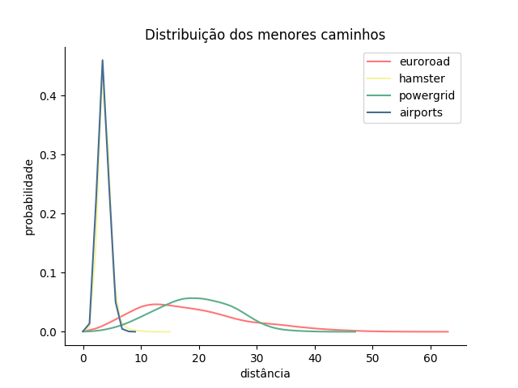
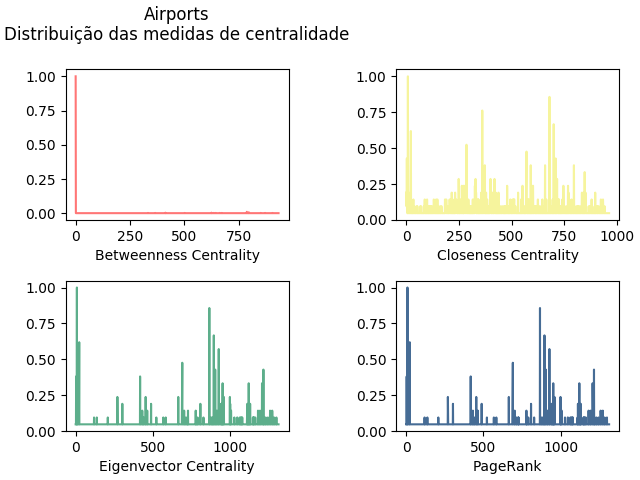
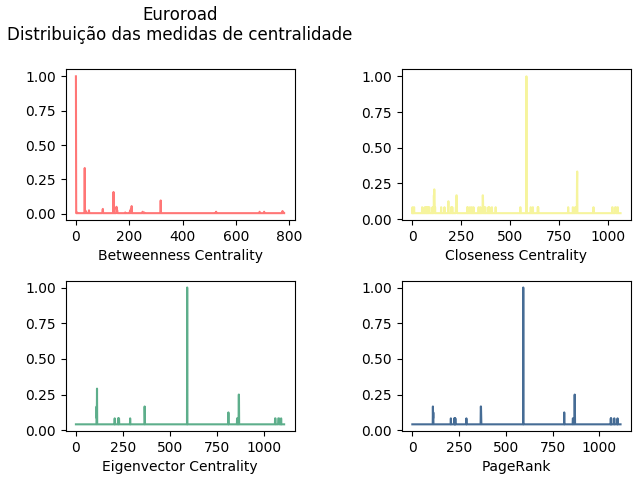
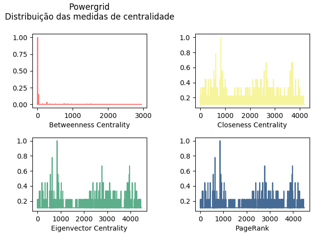
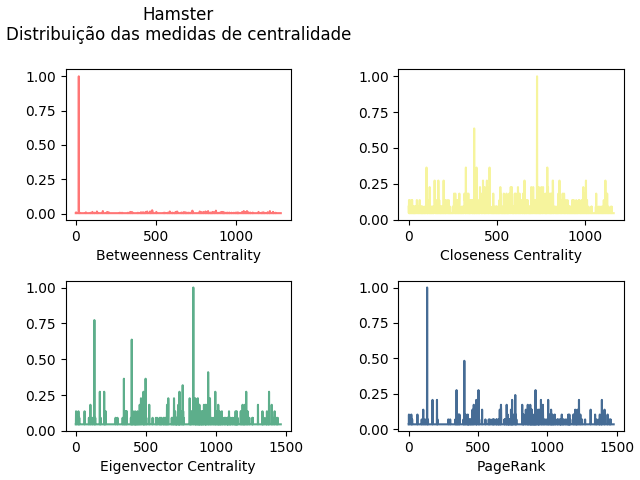
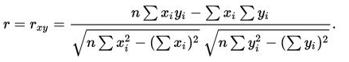
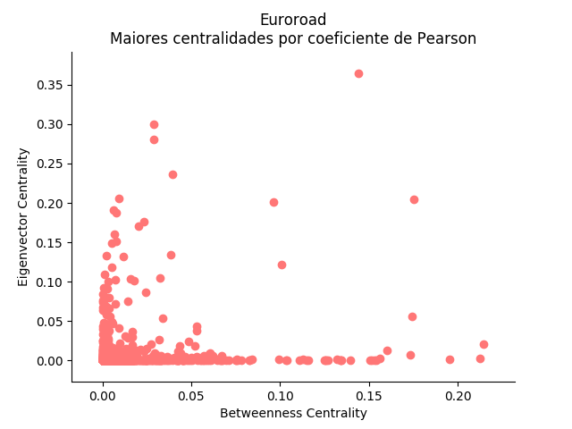
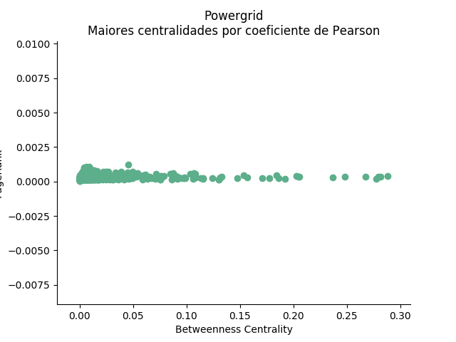
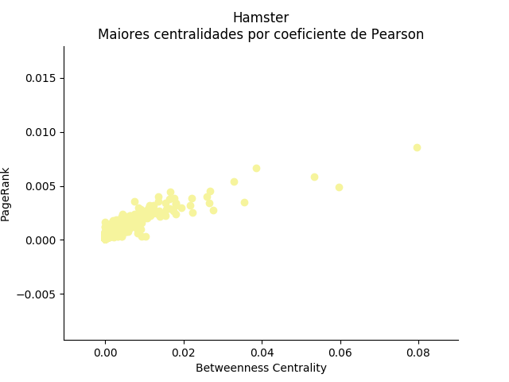
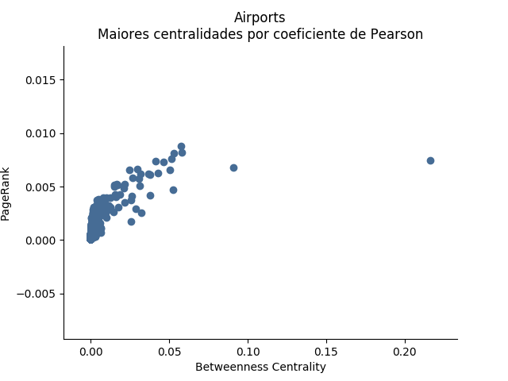

SME0130 - Redes Complexas

**Projeto 01 - Caracterização de Redes Complexas**

Felipe Scrochio Custódio - 9442688		

Gabriel Henrique Scalici - 9292970

* * *

# Introdução

O projeto consiste da análise de quatro redes distintas (retiradas do site: [http://konect.uni-koblenz.de/networks](http://konect.uni-koblenz.de/networks)), onde serão calculadas diversas medidas vistas em aula, para que possam ser melhores classificadas e compreendidas, como por exemplo, qual o componente mais conexo, o número de arestas e vértices, medidas de menores caminhos, dentre outras.

Além de gráficos contendo informações importantes para o entendimento da estrutura da rede como um todo, como por exemplo o histograma da distribuição acumulada do coeficiente de aglomeração local e distribuição dos menores caminhos.

O projeto foi desenvolvido utilizando a linguagem Python e as bibliotecas NetworkX, Matplotlib e Powerlaw. 

Os gráficos gerados estão em anexo também para melhor visualização. A numeração dos itens abaixo segue o PDF com a descrição do projeto.

1. Descrição das Bases

**EuroRoad:** 

É uma rede da categoria de infraestrutura sobre rodovias da Europa, onde cada nó representa uma determinada cidade, e cada arestas representa uma rodovia que liga duas cidades distintas.

Lembrando que o grafo possui arestas não orientadas e sem peso.

Resumidamente, uma aresta representa uma rodovia que liga duas cidades (cidade A e B por exemplo) onde é possível ir de A para B e também de B para A.

**Hamsterster:**

É uma rede da categoria de Social (Redes Sociais), que representa as relações de amizade entre pessoas cadastradas na mesma.

Os vértices representam as pessoas que são cadastradas na rede social e as arestas representam a relação de amizade entre elas (se existe ou não).

Lembrando que essa rede também possui arestas não orientadas e sem peso, isto é, se A é amigo de B, B também é amigo de A.

**PowerGrid:**

É uma rede da categoria de infraestrutura que representa informações sobre a rede de energia da região Oeste dos Estados Unidos da América.

Os nós podem representar tanto geradores de energia, transformadores ou subestações de energia, e as arestas representam linhas de energia que ligam tais fontes (nós).

Nessa rede as arestas também são não orientadas e não possuem pesos. Pode ser entendida como um fio que liga dois fornecedores de energia A e B.

**US Airports:**

É uma rede da categoria de infraestrutura que representa as linhas aéreas americanas no ano de 2010.

Os nós representam aeroportos, e arestas representam as ligações aéreas entre elas, ou seja, os vôos que são feitos de um aeroporto à outro.

Nesse caso temos arestas direcionadas (Se um avião vai do aeroporto A ao B, não significa que um de B vá a A) e as arestas possuem pesos (Distância físicas entre cada um dos aeroportos). Porém como foi aconselhado pelo professor, tais características foram desprezadas, então estamos analisando tal rede como não direcionada e arestas sem peso.

		 	 	 					 	

# 4. Redes sem Escala

Analisando as redes temos:

	Livre de escala:

* EuroRoads

* USAirports

	Não livre de escala:

* Hamster

* PowerGrid

# 5. Medidas

<table>
  <tr>
    <td>MEDIDAS / REDE</td>
    <td>EuroRoad</td>
    <td>Hamster</td>
    <td>Powergrid</td>
    <td>Airports</td>
  </tr>
  <tr>
    <td>Número de vértices:</td>
    <td>1039</td>
    <td>1788</td>
    <td>4941</td>
    <td>1572</td>
  </tr>
  <tr>
    <td>Grau médio:</td>
    <td>2.5120</td>
    <td>13.9553</td>
    <td>2.6691</td>
    <td>21.9008</td>
  </tr>
  <tr>
    <td>Segundo momento da distribuição do grau:</td>
    <td>7.7536</td>
    <td>635.6063</td>
    <td>10.3327</td>
    <td>2457.8944</td>
  </tr>
  <tr>
    <td>Média do coef. de aglomeração local: </td>
    <td>0.0189</td>
    <td>0.1433</td>
    <td>0.0801</td>
    <td>0.5048</td>
  </tr>
  <tr>
    <td>Transitividade:</td>
    <td>0.0353</td>
    <td>0.0904</td>
    <td>0.1032</td>
    <td>0.3841</td>
  </tr>
  <tr>
    <td>Média dos menores caminhos:</td>
    <td>18.3951</td>
    <td>3.4526</td>
    <td>18.9892</td>
    <td>3.1152</td>
  </tr>
  <tr>
    <td>Diâmetro:</td>
    <td>62.0</td>
    <td>14.0</td>
    <td>46.0</td>
    <td>8.0</td>
  </tr>
  <tr>
    <td>Entropia de Shannon:</td>
    <td>2.0037</td>
    <td>4.9679</td>
    <td>2.4552</td>
    <td>4.9894</td>
  </tr>
  <tr>
    <td>Coeficiente de distribuição de grau: </td>
    <td>2.8477</td>
    <td>1.6607</td>
    <td>1.4959</td>
    <td>2.0651
</td>
  </tr>
  <tr>
    <td>Escala</td>
    <td>Livre de escala</td>
    <td>Não é livre de escala</td>
    <td>Não é livre de escala</td>
    <td>Livre de escala</td>
  </tr>
</table>

Com base na tabela, a rede mais heterogênea é a rede de aeroportos e a rede social Hamster, pois tanto na análise se aglomeração local, quanto triângulos da fórmula da transitividade, possuem os valores mais altos. O que é fácil de compreender pois no caso da rede aérea, aeroportos próximos tem muitas conexões entre si. A rede social pode ser explicada por uma ideia de "comunidades", onde em por exemplo uma empresa, muitas pessoas se conhecem e possuem relação de amizade na rede social.

A análise dos triângulos faz sentido, como no caso das rodovias, possui um valor baixo porque uma cidade pode estar ligada com mais três ou quatro cidades próximas que podem ter relação entre si, já a rede aérea tem o valor alto pois o avião pode fazer o caminho direto até outros lugares distantes, dessa forma um aeroporto conversa com outro dez quinze aeroportos que podem ter relação entre si, aumentando assim a quantidade de triângulos.

Sendo assim, as redes com maiores valores de transitividade e aglomeração local tem em comum o grande número de ligações com outros vértices e o alto valor do segundo momento de distribuição do grau.

Analisando o diâmetro vemos que o menor valor é o da rede de aeroportos, seguido pela rede social Hamster, e os maiores valores são da rede de energia e a rede de rodovias. 

O que é fácil de ser verificado pois para chegar até algum outro vértice, você deve passar por no máximo o tamanho diâmetro, sendo assim, de avião é possível ir a outro aeroporto (distante fisicamente) sem passar por vários outros, como é o caso da rodovia e rede de energia, que de uma cidade para outra, é necessário passar por várias outras cidades. 

O valor para rede social pode ser explicado pois há várias relações de amizade interligadas, sendo assim a amizade dos seus amigos, faz com que você tenha um alcance muito grande de pessoas. 

Pode ser observado de maneira mais intuitiva olhando para o grau médio de cada rede, onde nas com o menor diâmetro possuem o grau muito maior do que as que possuem o diâmetro grande.

# 6. Histogramas

Com a análise das medidas acima, como por exemplo a difença entre os graus médios da rede e coeficiente de aglomeração local, é possível compreender a razão dos valores obtidos por meio dos histogramas, tendo como foco principal o que os vértices e arestas das redes representam e o modo que funcionam no mundo real.

**Coeficiente de aglomeração**

 

Pode ser dito, depois da análise das redes, que o coeficiente de aglomeração local da EuroRoad e PowerGrid fica praticamente constantes no histograma, e o da USAirports e Hamster crescem de maneira significativa.

Tal observação pode ser explicada pelo fato que as duas que ficam praticamente constantes, possuem relativamente poucas ligações (Olhando para a medida de grau médio) com outros nós, e seus vizinhos também seguem o mesmo padrão. Como o caso da EuroRoad, onde as cidades (vértices) se conectam às poucas cidades próximas (vértices adjacentes) e tais cidades à seus respectivos vizinhos próximos, fazendo com que o histograma mantenha os valores.

Há redes que os vértices estão ligados à muitos triângulos, como pode ser verificado em USAirports e Hamster, que aumentam significativamente a frequência quando o coeficiente de aglomeração vai de 0 até 1. Já as outras duas redes, permanecem praticamente constantes em tal intervalo.

**Menores caminhos**

O que pode ser dito sobre os caminhos mínimos, observando o histograma, é que novamente, EuroRoad e PowerGrid, por se ligarem apenas à alguns poucos vértices, a probabilidade se mantém baixa conforme a distância aumenta, fazendo com que o gráfico seja praticamente constante.

As redes com maior variação de caminhos mínimos, verificando o histograma, são USAirports e hamster, onde a explicação seria o fato de possuírem o grau médio muito elevado, de forma que é relativamente mais fácil andar de um vértice a outro sem passar por tantos outros nós. Ao contrário das redes EuroRoad e PowerGrid, onde tais valores de grau médio são baixos, fazendo com que não haja uma grande variação no comprimento.

	

# 7. Distribuição das Centralidades

	
**Distribuição de betweenness centrality se aproxima de uma lei de potência?**

Calculando o expoente da função Fit da lei de potência, vemos que nenhum coeficiente se encaixa entre 2 e 3, ou seja, nenhum betweenness centrality se encaixa em uma lei de potência.

**Maior variacão de closeness centrality**

Tendo como base que quanto mais central é o nó, menor sua distância para qualquer outro nó da rede, temos que as maiores variações de closeness centrality é no USAirports e Hamster, pois o gráfico de frequência oscila entre um valor grande e pequeno durante todo o gráfico, comparado aos outros, que mantém mais ou menos uma mesma faixa de valor, aumento muito ou diminuindo muito apenas em alguns pontos específicos. 

**Eigvector e PageRank indica que há vertices mais centrais que outros? **

Sim, pode indicar os vértices mais centrais, seguindo o raciocínio de que se um nó importante é vizinho de um grande número de nós, todos eles ganham importância (Como se você tivesse um blog no site da UOL, como o site da uol atinge muitas pessoas, logo você passa a atingir muitas pessoas). Dessa forma é possível verificar quais são mais centrais (alcançam mais nós) que outros.	 	

 	 		

# 8. Correlações entre centralidades

**Correlação entre medidas por coeficiente de Pearson**

Nós tivemos dificuldade na implementação do coeficiente em Python. 

Fizemos uma função *pearson* para calcular a seguinte fórmula.

Como parâmetro, enviamos as centralidades calculadas pelo NetworkX. O NetworkX retorna um dicionário cujas chaves são os nós e os valores são as medidas. Passamos apenas os valores desse dicionário para a função. Porém, durante a conta, valores estranhos começaram a surgir e ficamos tentando debugar, sem sucesso. 

Isso resultou em resultados errados que não permitem saber com clareza qual a correlação entre as centralidades.

Caso os resultados estivessem corretos, saberíamos que o coeficiente, indo de -1 a 1, caso fosse positivo nos indicaria que as centralidades basicamente crescem juntas e se fosse negativo que elas são inversamente proporcionais. 0 indicaria nenhuma correlação.

Do resto, acreditamos que a implementação está correta, conseguimos fazer uma função que já descobre quais as maiores medidas e plota corretamente as duas centralidades. Isso foi um desafio pois misturou vários tipos de variáveis e a lógica para pegar a chave de um dicionário a partir de um valor estava um pouco confusa. Ainda somos iniciantes em Python. 

As medidas que encontramos foram as seguintes:

**Euroroad**

Betweenness x Closeness 9.2121003546933001e-18

Betweenness x Eigenvector 0.15642606940985437

Betweenness x Pagerank 0.0039002169863223434

Closeness x Eigenvector 0.12726380081124078

Closeness x Pagerank 0.0004175953873120809

Eigenvector x Pagerank 0.0021297770782361214

**Hamster**

Betweenness x Closeness 4.7304718131664515e-18

Betweenness x Eigenvector 7.32371997408262e-17

Betweenness x Pagerank 0.13344436713372373

Closeness x Eigenvector 0.03656861454887308

Closeness x Pagerank 0.0008575407555485472

Eigenvector x Pagerank 0.022870581209538776

**Powergrid**

Betweenness x Closeness 3.139450485035632e-18

Betweenness x Eigenvector -0.00039941806943372935

Betweenness x Pagerank 0.0015213545282386292

Closeness x Eigenvector -0.047929628091341665

Closeness x Pagerank 0.00036662947945863847

Eigenvector x Pagerank 0.0006486738347234369

**Airports**

Betweenness x Closeness 3.36336382396792e-18

Betweenness x Eigenvector 7.079924971956251e-17

Betweenness x Pagerank 0.08924739003035137

Closeness x Eigenvector 0.05057339906061377

Closeness x Pagerank 0.0018904372341600859

Eigenvector x Pagerank 0.033742412550848234

			

